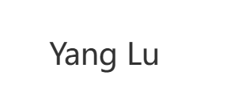

# 基于LSB（最低比特位）原理的图片隐写技术

## 1. 基本概念

### 1.1 什么是LSB算法

LSB（Least Significant Bit，最低有效位）算法是一种基于空域的数字水印技术，通过替换载体图像像素值的最低有效位来嵌入水印信息。它是最简单、最直观的数字水印算法之一。

### 1.2 基本原理

- **载体图像**：用于承载水印信息的原始图像
- **水印信息**：需要嵌入的秘密信息（通常是二值图像、文本或其他数字信息）
- **最低有效位**：二进制数中权重最小的位，对数值影响最小

## 2. 算法原理

### 2.1 二进制表示

每个像素值都可以用8位二进制数表示：

```
例如：像素值 154 = 10011010₂
位权重：     128 64 32 16 8 4 2 1
             1  0  0  1  1 0 1 0
             ↑                 ↑
           最高位             最低位(LSB)
```

### 2.2 嵌入过程

1. **水印预处理**：将水印转换为二进制序列
2. **载体像素选择**：选择用于嵌入的像素位置
3. **LSB替换**：用水印位替换载体像素的最低有效位
4. **生成含水印图像**：保存修改后的图像

### 2.3 提取过程

1. **读取含水印图像**
2. **提取LSB**：从指定像素位置提取最低有效位
3. **重构水印**：将提取的位序列重构为水印信息

## 3. 数学模型

### 3.1 嵌入公式

对于载体像素 `I(i,j)` 和水印位 `w`：

```
I'(i,j) = I(i,j) - (I(i,j) mod 2) + w
```

其中：

- `I'(i,j)` 是嵌入水印后的像素值
- `w ∈ {0,1}` 是水印位
- `mod` 是取模运算

### 3.2 提取公式

```
w = I'(i,j) mod 2
```

## 4. 算法特点

### 4.1 优点

- **简单高效**：算法实现简单，计算复杂度低
- **透明性好**：对图像质量影响极小，肉眼难以察觉
- **容量大**：理论上可以嵌入与载体图像像素数相等的水印位数
- **实时性强**：嵌入和提取速度快，适合实时应用
- **通用性强**：适用于各种类型的数字图像

### 4.2 缺点

- **鲁棒性差**：对各种图像处理操作极其敏感
- **安全性低**：容易被检测和攻击
- **脆弱性强**：轻微的噪声、压缩、几何变换都会破坏水印
- **抗攻击能力弱**：无法抵抗恶意攻击

## 5. 常见变种

### 5.1 多位LSB

- 使用多个最低有效位（如2-3位）
- 增加嵌入容量但降低图像质量
- 提高一定的鲁棒性

### 5.2 随机LSB

- 使用密钥控制嵌入位置
- 提高安全性
- 防止简单的统计分析攻击

### 5.3 多通道LSB

- 在RGB图像的多个通道中嵌入
- 分散嵌入风险
- 增加嵌入容量

## 6. 应用场景

### 6.1 适用场景

- **版权标识**：在不需要高鲁棒性的场合
- **数据隐藏**：秘密通信中的信息隐藏
- **完整性验证**：检测图像是否被篡改
- **原型研究**：作为基础算法进行改进

### 6.2 不适用场景

- **版权保护**：需要抵抗各种攻击
- **司法取证**：需要高度可靠的水印
- **商业应用**：需要鲁棒水印的场合

# 运行效果

## 原始图片


## 水印图片



## 嵌入水印


## 提取水印


