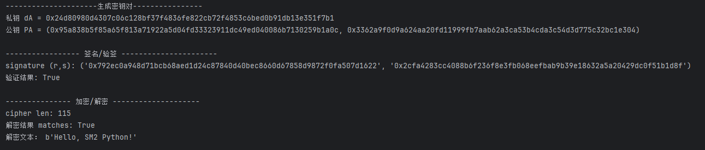
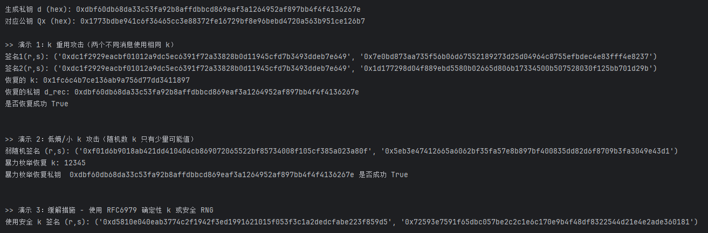
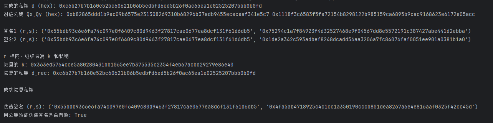

# SM2 算法

SM2 是一种 **基于椭圆曲线密码学** 的公钥密码算法。

SM2 标准其实是一个系列，涵盖了：

### 1.1 SM2 椭圆曲线公钥加密算法

- 类似于 **ECC 公钥加密**（ElGamal 变体）
- 用于加密数据

### 1.2 SM2 数字签名算法

- 类似于 **ECDSA**
- 用于身份认证和数据完整性保护

### 1.3 SM2 密钥交换协议

- 类似于 **ECDH**，但加入了身份绑定机制，提高抗中间人攻击能力

## 2. 算法流程详解

### 2.1 数字签名

#### 签名生成

1. 生成随机数k（1 < k < n-1）
2. 计算椭圆曲线点(x₁, y₁) = k×G
3. 计算r = (e + x₁) mod n，其中e是消息摘要
4. 如果r = 0，返回步骤1
5. 计算s = (d⁻¹ × (k - r×dₐ)) mod n，其中dₐ是私钥
6. 如果s = 0，返回步骤1
7. 签名值为(r, s)

#### 签名验证

1. 验证r和s是否在有效范围内
2. 计算t = (r + s) mod n
3. 计算椭圆曲线点(x₁', y₁') = s×G + t×Pₐ，其中Pₐ是公钥
4. 计算R = (e + x₁') mod n
5. 验证R是否等于r

### 2.2 密钥交换

#### 发起方A

1. 生成随机数rₐ，计算Rₐ = rₐ×G
2. 发送身份信息和Rₐ给对方
3. 接收对方的Rᵦ
4. 计算共享密钥材料
5. 通过密钥导出函数生成会话密钥

#### 响应方B

1. 生成随机数rᵦ，计算Rᵦ = rᵦ×G
2. 接收A的信息和Rₐ
3. 发送身份信息和Rᵦ给A
4. 计算相同的共享密钥材料
5. 导出相同的会话密钥

### 2.3 公钥加密

#### 加密过程

1. 获取接收方公钥Pᵦ
2. 生成随机数k，计算C₁ = k×G
3. 计算S = h×Pᵦ（h是余因子，通常为1）
4. 计算(x₂, y₂) = k×Pᵦ
5. 使用KDF密钥导出函数生成密钥流t
6. 计算C₂ = M ⊕ t（M是明文消息）
7. 计算C₃ = Hash(x₂ || M || y₂)
8. 密文为C = C₁ || C₂ || C₃

#### 解密过程

1. 从密文C中分离出C₁、C₂、C₃
2. 使用私钥dᵦ计算(x₂', y₂') = dᵦ×C₁
3. 使用KDF生成相同的密钥流t'
4. 计算M' = C₂ ⊕ t'
5. 计算u = Hash(x₂' || M' || y₂')
6. 验证u是否等于C₃，相等则输出M'

## 3. 关键要点

- 所有运算都在椭圆曲线群上进行
- 随机数的生成质量直接影响算法安全性
- 密钥导出函数（KDF）用于生成所需长度的密钥材料
- 哈希函数通常使用SM3算法

## 测试用例

# 本 PoC 包含三部分：

1. k 重用攻击（两个不同消息用同一个随机数 k → 恢复私钥）。
2. 低熵/小 k 攻击（签名时随机数 k 太小，暴力枚举即可恢复私钥）。
3. 缓解措施示例：使用 RFC6979 确定性 k 或安全 RNG。

## 运行测试

# 签名伪造

重用随机数 k 时，攻击者从两次不同消息的签名中可以恢复出 k 与私钥，然后用恢复的私钥为另一条消息签名。

## 运行测试

